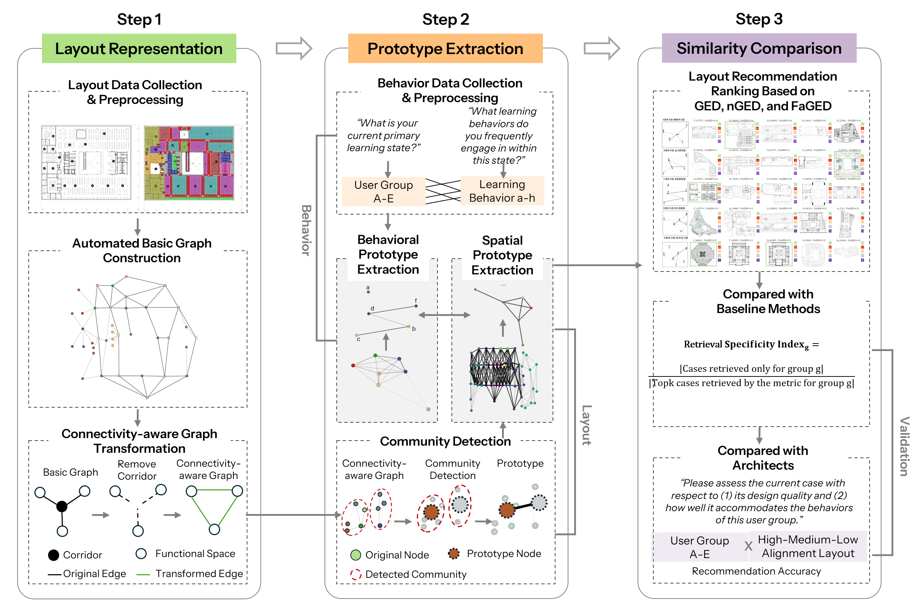
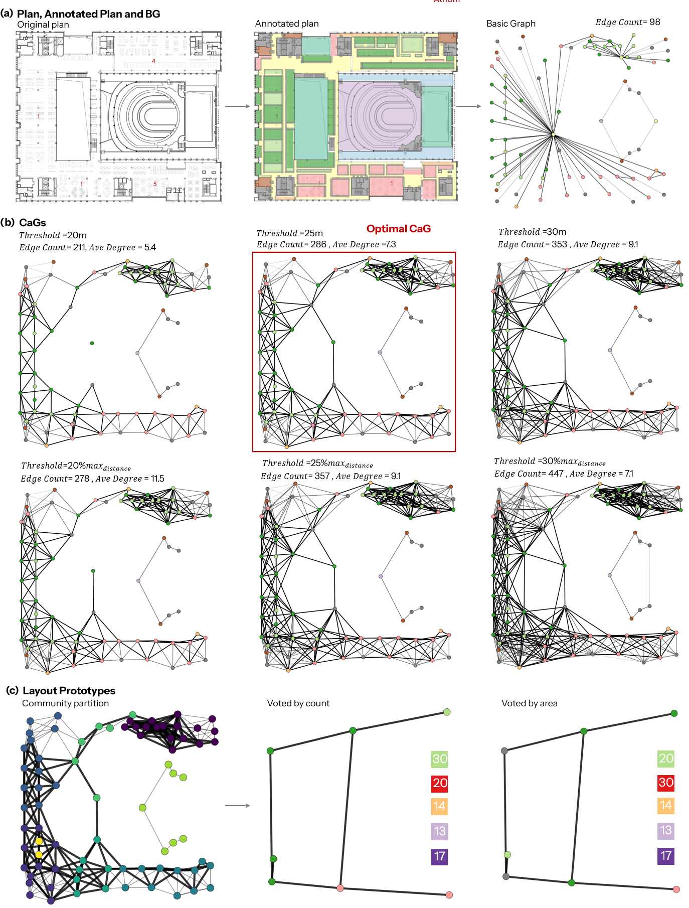

## FaGED: A Function-aware Graph-based Layout Retrieval Approach for Open-plan University Libraries
FaGED Pipeline is a research-oriented Python library for comparing spatial layouts and human behavioral patterns using function-aware graph representations.
In addition, this pipeline can also be used independently to construct graph representations of complex architectural layouts with open spaces, as well as to extract layout prototypes from such configurations.

This document demonstrates a **minimal, reproducible workflow** for:

1. Installing the library  
2. Building a **layout graph** and a **behavioral graph**  
3. Extracting **prototypes** for layouts
4. Computing a **function-aware graph edit distance (FaGED)**  

---
## 1) Installation

If you run this example locally:

```bash
pip install faged-pipeline
```

Or install from source:

```bash
git clone https://github.com/your-org/faged-pipeline.git
cd faged-pipeline
pip install -e .
```
---

## 2) Quick Start

Please refer to quick_start.ipynb.

This notebook shows how to run **Step0–Step5** either **individually** or in **custom combinations**.

### Expected input folder layout

```
DATA_ROOT/
├─ json/          # Annotated floor plans in a JSON format
├─ jpg/           # Floor plan images with same filename stem as JSON
└─ behavior_csv/  # Users' requirements matrices (correlations between different functions)
```
We provide a small example dataset (5 samples) to demonstrate the full pipeline execution.
The complete dataset (150 images) is not publicly released due to data usage agreements.

### Recommended output layout

```
OUTPUT_ROOT/
├─ step0_checks/      # Invalid polygons, corridor labels, functional labels, isolated nodes
├─ step1_behavior/    # Behavior graphs
├─ step2_basegraphs/  # Basic graphs reflecting circulation structure
├─ step3_transform/   # Connectivity-aware graphs reflection functional proximity
│  ├─ variants/       # All CaGs generated based on different distance thresholds
│  └─ selected/       # Optimal CaGs selected automatically by threshold
├─ step4_prototype/   # Layout prototypes
└─ step5_faged/       # GED, nGED, FaGED values and retrieval rankings
```
### Set up
```python
import sys, os
sys.path.append(os.path.abspath(".."))  
from faged_pipeline import run_step0, run_step1, run_step2, run_step3, run_step4_then_step5

from pathlib import Path

# ---- set your paths here ----
PROJECT_ROOT = Path("") #<--#set your project folder here
DATA_ROOT = PROJECT_ROOT / "DATA_ROOT"         
OUTPUT_ROOT   = PROJECT_ROOT / "OUTPUT_ROOT"    
JSON_DIR = DATA_ROOT / "json"
JPG_DIR  = DATA_ROOT / "jpg"
BEHAVIOR_CSV_DIR = DATA_ROOT / "behavior_csv"   # optional if you are just conduction graph representation, prototype extraction for layouts

OUTPUT_ROOT.mkdir(parents=True, exist_ok=True)
print("DATA_ROOT:", DATA_ROOT.resolve())
print("OUTPUT_ROOT:", OUTPUT_ROOT.resolve())
```
### Step0 — Annotation checks (manual QA)

Step0 is designed to generate **visual inspection outputs** (PNGs) so you can quickly spot
annotation issues and fix your code/labels.

Available checks:
- `"invalid"`: invalid polygons + missing `group_id` (to check if there are polygons which are invalid or without groupID)
- `"corridor"`: corridor polygons (label=12) with group IDs (to check if the groupID of corridor segments are correct)
- `"labels"`: function label color overlay (to check if functional labels are correct)
- `"connectivity"`: connectivity visualization + isolated nodes report (to check if there are wrong connections)

```python
from faged_pipeline.step0_checks import run_step0_checks

run_step0_checks(
    json_folder=str(JSON_DIR),
    jpg_folder=str(JPG_DIR),
    out_root=str(OUTPUT_ROOT / "step0_checks"),
    # choose any subset, e.g. ("invalid",) or ("labels", "connectivity")
    checks=("invalid", "corridor", "labels", "connectivity"),
)
```

### Step1 — Build behavioral graphs

**If you're just conducting layout analysis, you can skip this step.**
In default mode, this step takes the co-occurrence frequency matrix between different behaviors as input. Therefore, it requires the `people_counts` provided by you,which represents the total number of individuals who provided behavioral data. The method supports multiple user groups, labeled as “A”, “B”, “C”, “D”, and so on.

The input matrix can also be replaced by a matrix representing functional relationship strengths obtained through other methods, as long as it is in matrix form. In this case, `people_counts` can be directly set to 1.

- Input: behavior matrices CSVs (e.g., `A.csv`)
- Output: pickled graphs (`.pkl`) + optional visualizations

```python
from faged_pipeline.step1_behavior import run_step1_build_behavior_graphs

# Example: you must fill this dict based on your experiment
people_counts = {
    "A": 339,
    "B": 70,
}
node_categories = {
    'a': "3", 'b': "6", 'c': "2", 'd': "9",
    'e': "9", 'f': "9", 'g': "5", 'h': "8", 'i': "3"
}

run_step1_build_behavior_graphs(
    csv_dir=str(BEHAVIOR_CSV_DIR),
    output_dir=str(OUTPUT_ROOT / "step1_behavior"),
    people_counts=people_counts,
    node_categories=node_categories
)
```

### Step2 — Build base graphs (BG)

Build function- and area-aware base graphs from JSON files. The JSON files are annotated by LabelMe (Wada,2021) or X-Any-Labelling.

- Input: `DATA_ROOT/json/*.json`
- Output: `OUTPUT_ROOT/step2_basegraphs/*.pkl` (+ optional `.png`)

```python
from faged_pipeline import run_step2

run_step2(
    json_folder=str(JSON_DIR),
    output_folder=str(OUTPUT_ROOT / "step2_basegraphs"),
    save_png=True,
)
```

### Step3 — Transform to CaG + auto-select best variant

Generates several graph variants (relative(20%,25%,30% of the max distance in the current plan)/absolute(20m,25m,30m) thresholds), then selects the best
variant per file using the default heuristic (avg degree target 6–8).

- Input: `OUTPUT_ROOT/step2_basegraphs/*.pkl`
- Output:
  - variants: `OUTPUT_ROOT/step3_transform/variants/<variant_name>/*.pkl`
  - selected: `OUTPUT_ROOT/step3_transform/selected/*.pkl`
  - selection log: `step3_selected_variant.csv`

```python
from faged_pipeline import run_step3, Step3Config

cfg3 = Step3Config(
    # avg_degree means the average degrees of nodes in the genated CaG. 6-8 are set as the optimal defaults according to experiments in university libraries; customize if you want
    # avg_degree_min=6.0,
    # avg_degree_max=8.0,
)

df_selected = run_step3(
    basegraph_folder=str(OUTPUT_ROOT / "step2_basegraphs"),
    json_folder=str(JSON_DIR),
    output_root=str(OUTPUT_ROOT / "step3_transform" / "variants"),
    selected_output_folder=str(OUTPUT_ROOT / "step3_transform" / "selected"),
    cfg=cfg3,
    save_png=True,
    )
df_selected.head()
```
### Step4 — Extract layout prototypes 
Runs commnunity detection (default as Infomap (Edler, Holmgren, & Rosvall, 2025)) at one or more Markov times and saves simplified prototype graphs.

The function of each prototype node is determined based on the nodes within the corresponding originally detected community, using either the dominant function by count or the function associated with the largest area.

- Input: selected CaG graphs from Step3
- Output: per-parameter folders under `OUTPUT_ROOT/step4_prototype/graphs/markov_*`

```python
from faged_pipeline.step4_prototype import run_step4_infomap, InfomapConfig

cfg4 = InfomapConfig(
    input_folder=str(OUTPUT_ROOT / "step3_transform" / "selected"),
    graph_output_root=str(OUTPUT_ROOT / "step4_prototype" / "graphs"),
    community_img_output_root=str(OUTPUT_ROOT / "step4_prototype" / "communities"),
    markov_times=(0.7, 0.75, 0.8),
    main_function_mode="count",  # or "max_area"
)

run_step4_infomap(cfg4)
```

### Step5 — Compute GED / nGED / FaGED 

Compares *target graphs* (e.g., Step1 behavior graphs) to *reference prototype graphs* (Step4).

- Target: `OUTPUT_ROOT/step1_behavior/*.pkl`
- Reference: `OUTPUT_ROOT/step4_prototype/graphs/markov_*/`
- Output: `OUTPUT_ROOT/step5_faged/markov_*/...`

```python

from faged_pipeline.step5_faged import Step5BatchConfig, run_step5_batch_from_markov_folders, merge_step5_csvs_to_long_table

cfg5 = Step5BatchConfig(
    step4_graph_output_root=str(OUTPUT_ROOT / "step4_prototype" / "graphs"),
    target_folder=str(OUTPUT_ROOT / "step1_behavior"),
    step5_output_root=str(OUTPUT_ROOT / "step5_faged"),
    markov_folders=["markov_0_7"],  # markov_folders=["markov_0_7"],   # or ["markov_0_7", "markov_0_75"]
    do_ged=True,#False if you do not need graph edit distance
    do_nged=True,#False if you do not need normalized graph edit distance
    do_faged=True,
    timeout=30,
)

summary_df = run_step5_batch_from_markov_folders(cfg5)
summary_df.head()

long_df = merge_step5_csvs_to_long_table(
    csv_root=str(OUTPUT_ROOT / "step5_faged" / "markov_0_7"),
    output_csv=str(OUTPUT_ROOT / "step5_faged" / "markov_0_7" / "step5_long_ranked.csv")
)

long_df.head()

```
### Optional: common custom combinations

#### A) Step2 → Step3 (layout graph representation only)
```python

from faged_pipeline import run_step2_then_step3, Step3Config

df_sel = run_step2_then_step3(
    json_folder=str(JSON_DIR),
    step2_output_folder=str(OUTPUT_ROOT / "step2_basegraphs"),
    step3_output_root=str(OUTPUT_ROOT / "step3_transform" / "variants"),
    step3_selected_folder=str(OUTPUT_ROOT / "step3_transform" / "selected"),
    step3_cfg=Step3Config(),
    save_png_step2=True,
    save_selection_csv_step3=True,
)
df_sel.head()
```
#### B) Step4 → Step5 (if you already have Step3 CaGs and Step 1 Behavioral Graphs)
```python

from faged_pipeline.pipeline import Step4Step5Config, run_step4_then_step5
from faged_pipeline.step4_prototype import InfomapConfig
from faged_pipeline.step5_faged import Step5BatchConfig

cfg = Step4Step5Config(
    step4=InfomapConfig(
        input_folder=str(OUTPUT_ROOT / "step3_transform" / "selected"),
        graph_output_root=str(OUTPUT_ROOT / "step4_prototype" / "graphs"),
        community_img_output_root=str(OUTPUT_ROOT / "step4_prototype" / "communities"),
        markov_times=(0.7, 0.75, 0.8),
        main_function_mode="count",
    ),
    step5=Step5BatchConfig(
        step4_graph_output_root=str(OUTPUT_ROOT / "step4_prototype" / "graphs"),
        target_folder=str(OUTPUT_ROOT / "step1_behavior"),   
        step5_output_root=str(OUTPUT_ROOT / "step5_faged"),
        do_ged=True,
        do_nged=True,
        do_faged=True,
        timeout=30,
        markov_folders=["markov_0_7"] # markov_folders=["markov_0_7", "markov_0_75"]/markov_folders= None (run for all)
    ),
)

summary_df = run_step4_then_step5(cfg)
summary_df.head()
```


---


## 3) Method Overview

```text
Input: Annotated Json                                        Behavior Matrix
  │                                                                  |
  ▼                                                                  |
Step 0: Annotations Check                                            |
("invalid", "corridor", "labels", "connectivity")                    |         
  │                                                                  |
  ▼                                                                  ▼
Step 2: Attributed Graphs (Layout)                  Step 1: Attributed Graphs (Behavior)
  │                                                                  |                                                             
  ▼                                                                  |
Step 3: Connectivity-aware Graphs (Layout)                          |
  │                                                                  |
  ▼                                                                  |
Step 4: Graph Prototypes                                             |
  │                                                                  |
  ▼                                                                  ▼
Step 5: Function-Aware Graph Edit Distance (FaGED),Distance Ranking

```


---
## 4) A Simple Case
Here we provide a detailed illustration of the proposed framework using a single real-world case study. The selected case is a real large university library building project with a gross floor area exceeding 60,000 m². The experimental setup, parameter choices, and algorithmic configurations used in this appendix are identical to those adopted in the main experiments.




---

## 5) Citation

```bibtex
@article{Guo2025FaGED,
  title     = {Function-Aware Graph-Based Layout Retrieval for Public Buildings},
  author    = {Guo, Song, Kee, Tris and Zhuang Weimin},
  journal   = {Automation in Construction},
  year      = {2025}
}
```

---
